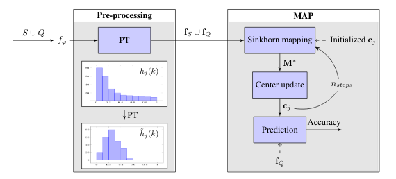

# Leveraging the Feature Distribution in Transfer-based Few-Shot Learning

This repository is the official implementation of Leveraging the Feature Distribution in Transfer-based Few-Shot Learning. 



## Requirements

To install requirements:

```setup
pip install -r requirements.txt
```

***Donwloading the dataset and create base/val/novel splits***:

miniImageNet
* Change directory to filelists/miniImagenet/
* Run 'source ./download_miniImagenet.sh'

CUB

* Change directory to filelists/CUB/
* Run 'source ./download_CUB.sh' 

CIFAR-FS
* Download [CIFAR-FS](https://drive.google.com/file/d/1pTsCCMDj45kzFYgrnO67BWVbKs48Q3NI/view)
* Decompress and change the filename to 'cifar-FS'
* Move the datafile to filelists/cifar/
* Run 'python write_cifar_filelist.py'

## Training

To train the feature extractors in the paper, run this command:

For miniImageNet/CUB<br/>
```train
python train.py --dataset [miniImagenet/CUB] --method [S2M2_R/rotation] --model [WideResNet28_10/ResNet18]
```

For CIFAR-FS<br/>
```train
python train_cifar.py --dataset cifar --method [S2M2_R/rotation] --model [WideResNet28_10/ResNet18]
```

## Evaluation

To evaluate my model on miniImageNet/CUB/cifar/cross, run:

```eval
python test_standard.py
```

## Pre-trained Models

You can download pretrained models and extracted features here:

- [trained models](https://drive.google.com/drive/folders/1uhX_YldcpVBzK2giGn-qZEHGSd6cCeBy?usp=sharing) trained on miniImageNet, CUB and CIFAR-FS using WRN. 

- Create an empty 'checkpoints' directory.
- Untar the downloaded file and move it into 'checkpoints' folder.

> 📋 To extract and save the novel class features of a newly trained backbone, run:
```save_features
python save_plk.py --dataset [miniImagenet/CUB] --method S2M2_R --model [trainedmodel]
```

## Results

Our model achieves the following performance (backbone: WRN) on :


| Dataset        | 1-shot Accuracy  | 5-shot Accuracy |
| ---------------|---------------| -------------|
| miniImageNet   |  82.92+-0.26% | 88.82+-0.13% |
| tieredImageNet |  85.41+-0.25% | 90.44+-0.14% |
| CUB            |  91.55+-0.19% | 93.99+-0.10% |
| CIFAR-FS       |  87.69+-0.23% | 90.68+-0.15% |
| cross domain   |  62.49+-0.32% | 76.51+-0.18% |


## References

[A Closer Look at Few-shot Classification](https://openreview.net/pdf?id=HkxLXnAcFQ)

[Charting the Right Manifold: Manifold Mixup for Few-shot Learning](https://arxiv.org/pdf/1907.12087v3.pdf)

[Manifold Mixup: Better Representations by Interpolating Hidden States](https://arxiv.org/pdf/1806.05236.pdf)

[Sinkhorn Distances: Lightspeed Computation of Optimal Transport](https://papers.nips.cc/paper/4927-sinkhorn-distances-lightspeed-computation-of-optimal-transport.pdf)

[Notes on optimal transport](https://github.com/MichielStock/Teaching/tree/master/Optimal_transport)
